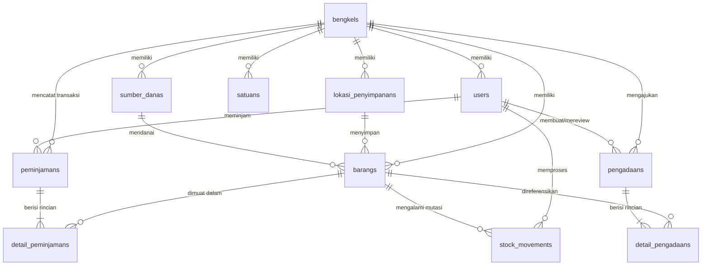

# PRD: SIBENKA (Sistem Inventaris Bengkel Skagata)

- **Versi Dokumen:** 2.0 (Production Release Specification)
- **Tanggal Rilis:** 30 September 2026
- **Status:** Disetujui & Terimplementasi Penuh (Post-Remediation)
- **Target Institusi:** SMK Negeri 3 Yogyakarta

---

## 1. Tujuan & Latar Belakang

### 1.1 Latar Belakang

SMK Negeri 3 Yogyakarta (Skagata) memiliki beragam unit bengkel kejuruan (TKJ, TAV, TITL, TKR, TP, TBSM, dll.) dengan intensitas sirkulasi peminjaman alat praktik dan konsumsi bahan yang tinggi setiap harinya. Pengelolaan manual rentan menyebabkan kehilangan alat, kerusakan fisik yang tidak terpantau penanggung jawabnya, stok bahan praktik yang mendadak habis (_stock-out_), serta hambatan administrasi penyusunan Rencana Anggaran Biaya (RAB) pengadaan sekolah.

### 1.2 Tujuan Utama Sistem

Sistem Informasi Inventaris Bengkel Skagata (**SIBENKA**) dibangun untuk:

1. **Digitalisasi Sirkulasi Alat:** Mencatat peminjaman alat secara akuntabel dengan alur verifikasi cek fisik kondisi barang (baik, rusak, hilang) saat pengembalian.
2. **Pengawasan Bahan Habis Pakai (BHP):** Memantau konsumsi bahan secara otomatis tanpa prosedur pengembalian, serta memberikan peringatan dini (_low-stock alert_) saat stok mendekati batas minimum.
3. **Penyusunan & Realisasi RAB:** Memfasilitasi Toolman menyusun draf RAB pengadaan berbasis kebutuhan riil bengkel, memproses persetujuan Waka Sarpras, dan mengotomatisasi pencatatan stok masuk saat barang fisik diterima.
4. **Integritas Audit Mutasi:** Menyediakan catatan riwayat pergerakan stok (_stock card/audit trail_) yang tidak dapat dimanipulasi, mendukung ekspor laporan resmi dalam format Spreadsheet dan dokumen cetak F4/Folio.

---

## 2. Definisi Peran & Hak Akses (User Roles)

Sistem menetapkan 3 level peran pengguna dengan batasan akses yang terisolasi secara ketat:

### 2.1 Super Admin (Waka Sarpras)

- Meninjau dashboard analitik eksekutif multi-bengkel (total aset sekolah, barang dipinjam, kerusakan alat, dan status stok BHP).
- Memverifikasi pengajuan RAB dari seluruh bengkel kejuruan dengan keputusan: **Approve (Setujui)**, **Revisi** (dengan catatan perbaikan), atau **Reject (Tolak)**.
- Mengakses dan mengunduh laporan rekapitulasi mutasi aset dan konsumsi bahan seluruh jurusan dalam format Excel dan PDF siap cetak.
- Mengelola master data unit bengkel (`bengkels`).
- Mengelola akun staf Toolman, penempatan bengkel tugas, dan mereset password akun Toolman jika diperlukan.
- Mengelola profil pribadi dan kata sandi mandiri.
- **Karakteristik Akun:** `bengkel_id` bernilai `NULL` karena Waka Sarpras mengawasi seluruh unit sekolah.

### 2.2 Admin Bengkel (Toolman)

- Terikat pada satu unit bengkel tertentu (`bengkel_id` wajib terisi).
- Mengelola master barang (Alat Inventaris dan Bahan Habis Pakai) pada bengkelnya (tambah, edit, hapus, cetak kartu barang, ekspor, dan impor spreadsheet).
- Mengelola master lokasi penyimpanan (`lokasi_penyimpanans`) di lingkup bengkelnya.
- Mengelola master satuan barang (`satuans`) yang digunakan bengkel.
- Mengelola master sumber dana anggaran (`sumber_danas`) pengadaan barang.
- Memproses antrean tiket peminjaman dari siswa dan guru (Approve atau Reject).
- Memproses cek fisik pengembalian alat inventaris dan mencatat jumlah unit kembali baik, rusak, atau hilang.
- Menyusun draf usulan RAB pengadaan bengkel dan mengajukannya ke Waka Sarpras.
- Melakukan **penerimaan fisik barang RAB** (`receive`) yang telah disetujui Waka, yang secara otomatis menambah stok atau mendaftarkan barang baru dengan audit mutasi.
- Memverifikasi registrasi akun peminjam baru (Approve atau Reject), serta menangguhkan (_suspend_) atau mengaktifkan kembali akun peminjam bermasalah.
- Memantau kartu stok dan riwayat mutasi bengkel (`mutasi`).
- Mengubah profil dan kata sandi mandiri.

### 2.3 Peminjam (Siswa & Guru)

- Mendaftar akun mandiri dan menunggu persetujuan (_approval_) dari Toolman.
- Menjelajahi katalog alat dan bahan praktik (_mobile-first_).
- Membuat permohonan pinjam dengan keranjang multi-item (_multi-item loan ticket_).
- Mengajukan pengembalian fisik alat inventaris melalui antarmuka _Tiket Saya_.
- Memantau status tiket sirkulasi secara _real-time_ (_Pending_, _Active_, _Terlambat_, _Menunggu Pengecekan_, _Selesai_, _Ditolak_).
- Mencetak bukti permohonan pinjam dan tanda terima pengembalian.
- Mengubah profil dan kata sandi mandiri.

**Klasifikasi Peminjam:**

- **Siswa (`jenis_peminjam = 'siswa'`):** Wajib terikat pada satu bengkel jurusan (`bengkel_id` wajib). Siswa hanya diizinkan meminjam barang yang berada di bengkel jurusannya.
- **Guru (`jenis_peminjam = 'guru'`):** Tidak terikat pada satu bengkel (`bengkel_id = NULL`). Guru diizinkan meminjam alat atau bahan lintas bengkel sesuai kebutuhan mata pelajaran yang diampu.

---

## 3. Aturan Bisnis Sistem (Business Rules)

### 3.1 Isolasi Data Multi-Bengkel

- Data bengkel (`bengkels`) menjadi partisi utama isolasi data barang, lokasi, dan transaksi sirkulasi.
- Toolman hanya dapat melihat dan memodifikasi data barang, lokasi, peminjaman, pengadaan, dan mutasi yang berada pada `bengkel_id` miliknya. Akses ke bengkel lain ditolak dengan kode respon HTTP 403 Forbidden.
- Kode barang dan kode lokasi penyimpanan bersifat unik per bengkel: kombinasi `(bengkel_id, kode_barang)` dan `(bengkel_id, kode)` tidak boleh duplikat, namun kode yang sama diperbolehkan berada pada bengkel yang berbeda.

### 3.2 Pencatatan Barang (Quantity-Based Inventory)

- Barang dicatat menggunakan pendekatan **Quantity-Based**, bukan nomor seri per unit. Satu baris barang merepresentasikan total stok fisik unit tersebut di bengkel.
- Setiap barang memiliki dua kategori utama (`jenis_barang`):
    1. **Inventaris:** Alat praktik yang wajib dikembalikan setelah kegiatan belajar selesai.
    2. **Bahan Habis Pakai (BHP):** Bahan praktik yang habis terkonsumsi dan tidak memiliki alur pengembalian.
- **Formula Konsistensi Stok Fisik Inventaris:**
  $$\text{stok\_total} = \text{stok\_tersedia} + \text{stok\_dipinjam} + \text{stok\_rusak}$$
- Setiap barang terikat pada satu lokasi penyimpanan utama (`lokasi_penyimpanan_id`), satu sumber dana anggaran (`sumber_dana_id`), satuan baku (`satuan`), batas minimum stok (`minimum_stok`), dan harga satuan/perolehan (`harga`).
- Data barang **tidak menggunakan foto/gambar upload** demi menjaga performa penyimpanan dan kepraktisan operasional bengkel sekolah. Antarmuka katalog menggunakan visualisasi berbasis ikon kategori yang ringan.

### 3.3 Sirkulasi Peminjaman & Pengembalian

- Peminjam dapat memasukkan kombinasi alat inventaris dan bahan habis pakai (BHP) ke dalam satu tiket pengajuan.
- Seluruh barang dalam satu tiket harus berasal dari bengkel yang sama.
- **Aturan Batas Waktu:** Alat inventaris wajib dikembalikan pada hari yang sama sebelum jam operasional bengkel berakhir. Sistem menyimpan batas waktu pengembalian pada `batas_kembali`. Jika tiket hanya memuat BHP, atribut `batas_kembali` bernilai `NULL`.
- **Dampak Approval Peminjaman:**
    - Untuk alat Inventaris: `stok_tersedia` berkurang, `stok_dipinjam` bertambah, `stok_total` tetap. Status tiket menjadi `active`.
    - Untuk Bahan (BHP): `stok_tersedia` berkurang, `stok_total` berkurang secara permanen, tercatat mutasi `bhp_keluar`. Jika tiket hanya berisi BHP, status tiket langsung berubah menjadi `selesai`.
- **Dampak Cek Fisik Pengembalian Inventaris:**
  Toolman memeriksa fisik barang dan mencatat rincian kondisi:
  $$\text{jumlah\_kembali\_baik} + \text{jumlah\_kembali\_rusak} + \text{jumlah\_hilang} = \text{jumlah\_dipinjam}$$
    - Unit kembali baik: dipindahkan dari `stok_dipinjam` ke `stok_tersedia` (mutasi `pengembalian_baik`).
    - Unit kembali rusak: dipindahkan dari `stok_dipinjam` ke `stok_rusak` (mutasi `pengembalian_rusak`).
    - Unit hilang: mengurangi `stok_dipinjam` dan mengurangi `stok_total` secara permanen (mutasi `barang_hilang`).
- **Kunci Konkurensi Transaksi (InnoDB Row Locking):**
  Pengecekan fisik dan persetujuan pinjam wajib mengunci baris database (`lockForUpdate()`) dengan urutan kunci deterministik (tiket peminjaman terlebih dahulu, disusul baris barang terurut menaik `ORDER BY id ASC`) untuk mencegah _race condition_ dan _deadlock_.

### 3.4 Sanksi Penalti Akun (_Suspend_)

- Toolman berhak menangguhkan (_suspend_) akun peminjam yang menghilangkan alat, merusak fasilitas, atau terlambat mengembalikan barang secara berulang.
- Akun dengan status `suspend` atau `menunggu_acc` otomatis ditolak oleh middleware otentikasi saat mencoba mengakses fitur peminjaman.
- Ganti rugi fisik atau penyelesaian sanksi diselesaikan secara tatap muka di ruang teknisi bengkel, dan akun dipulihkan (_activate_) kembali oleh Toolman setelah kewajiban terpenuhi.

### 3.5 Pengadaan, RAB, & Penerimaan Fisik Otomatis

- Toolman menyusun usulan RAB pengadaan barang untuk bengkelnya, baik untuk pengadaan barang baru maupun penambahan kuantitas barang eksisting.
- **Klasifikasi Eksplisit Barang Baru:** Setiap rincian barang baru pada RAB wajib memiliki penentuan tipe definitif (`inventaris` atau `bhp`) dan batas minimum stok (`minimum_stok`) secara eksplisit. Sistem **dilarang keras menebak klasifikasi** melalui kata kunci nama barang atau satuan.
- **Siklus Telaah Waka Sarpras:** Waka Sarpras meninjau RAB dan menetapkan status `approved`, `revisi`, atau `rejected`.
- **Integritas Anti-Tampering:** Klasifikasi jenis barang dan batas minimum yang telah disetujui Waka Sarpras terkunci permanen. Permintaan penerimaan fisik dilarang mengubah klasifikasi yang sudah disetujui resmi.
- **Eksekusi Penerimaan Fisik (`receive`):**
  Persetujuan Waka tidak langsung menambah stok barang. Penambahan stok fisik dilakukan saat barang benar-benar tiba di bengkel melalui aksi konfirmasi penerimaan fisik Toolman (`POST /toolman/pengadaan/{id}/receive`).
    - Jika barang sudah terdaftar (`barang_id` tidak null): menambah `stok_total` dan `stok_tersedia`.
    - Jika barang baru (`barang_id` null): sistem secara otomatis mendaftarkan entitas `Barang` baru dengan kodefikasi bengkel, klasifikasi resmi, harga satuan dari RAB, dan lokasi penyimpanan default.
    - Setiap barang yang diterima otomatis dicatat ke riwayat mutasi `stock_movements` jenis `stok_masuk` lengkap dengan nama aktor pelaksana dan referensi RAB.
    - Status pengadaan berubah menjadi `selesai`.

### 3.6 Keamanan Batasan Impor & Ekspor Spreadsheet

- **Format File Diterima:** Hanya file spreadsheet berekstensi `.xlsx` dan file teks murni `.csv` / `.txt` berkode UTF-8. Format legacy biner `.xls` ditolak secara eksplisit dengan instruksi konversi yang ramah pengguna.
- **Batasan Beban:** Maksimum ukuran file 5 MB, batas entri arsip ZipArchive 100 entri, batas teks XML 20 MB, dan batas baris pemrosesan maksimum 5.000 baris.
- **Proteksi XXE:** Parser XML menonaktifkan resolusi entitas eksternal (`LIBXML_NONET | LIBXML_NOENT`).
- **Pencegahan Formula Injection (CSV/Excel Formula Escaping):**
  Seluruh teks yang diekspor (nama barang, deskripsi, catatan, kode) dan diawali karakter formula (`=`, `+`, `-`, `@`, `\t`, `\r`) wajib diawali dengan tanda kutip tunggal (`'`) agar tidak dieksekusi sebagai ekspresi formula di Microsoft Excel / LibreOffice, tanpa merusak nilai numerik murni.
- **Transaksi All-or-Nothing:** Jika satu baris data pada berkas impor gagal divalidasi atau menabrak duplikasi kode, seluruh transaksi dibatalkan (_rollback_) tanpa meninggalkan data parsial di database.

### 3.7 Kebijakan Akun & Autentikasi Sekolah

- Sistem tidak menggunakan mekanisme pengiriman email lupa password publik (_Forgot/Reset Password via SMTP_) karena operasional bengkel tidak bergantung pada penyedia email publik eksternal.
- Siswa atau guru yang lupa kata sandi melapor langsung ke staf Toolman atau Superadmin di sekolah untuk di-reset secara manual.
- Rute registrasi publik dibatasi dengan _rate-limiting_ ketat (maksimum 6 permintaan per menit) guna menangkal bot atau serangan spam.
- Pengguna yang baru mendaftar mandiri berada pada status `menunggu_acc` hingga disetujui oleh Toolman penanggung jawab bengkel.

---

## 4. Manajemen Status (State Management)

### 4.1 Status Tiket Peminjaman (`peminjamans.status`)

```
             ┌───────────────┐
             │    Pending    │
             └───────┬───────┘
         Reject      │       Approve
     ┌───────────────┼───────────────┐
     ▼                               ▼
┌─────────┐                ┌──────────────────┐
│ Ditolak │                │ Active (Pinjam)  │───(Khusus BHP)───►┌─────────┐
└─────────┘                └─────────┬────────┘                   │ Selesai │
                                     │ Lewat Jam Bengkel          └─────────┘
                                     ▼                                 ▲
                           ┌──────────────────┐                        │
                           │    Terlambat     │                        │
                           └─────────┬────────┘                        │
                                     │ Ajukan Kembali                  │
                                     ▼                                 │
                           ┌──────────────────┐                        │
                           │ Menunggu Cek     │                        │
                           │ Fisik Toolman    │────────────────────────┘
                           └──────────────────┘  Verifikasi Fisik
```

### 4.2 Status Pengajuan RAB Pengadaan (`pengadaans.status`)

- `draft`: Usulan sedang disusun oleh Toolman dan belum dikirimkan.
- `pending`: Diajukan ke Waka Sarpras, menunggu telaah dan pertimbangan anggaran.
- `revisi`: Dikembalikan oleh Waka Sarpras ke Toolman disertai catatan perbaikan rincian barang.
- `approved`: Disetujui resmi oleh Waka Sarpras; dokumen terkunci dan siap dibelanjakan.
- `rejected`: Ditolak oleh Waka Sarpras; pengajuan dihentikan.
- `selesai`: Barang fisik telah tiba di bengkel dan penerimaan fisik telah diverifikasi oleh Toolman.

### 4.3 Status Akun Pengguna (`users.status`)

- `menunggu_acc`: Akun baru mendaftar mandiri, belum disetujui Toolman.
- `aktif`: Akun terverifikasi dan memiliki izin operasional penuh.
- `suspend`: Akun ditangguhkan akibat pelanggaran tata tertib bengkel (kehilangan/kerusakan/keterlambatan).
- `nonaktif`: Akun dinonaktifkan permanen (misal: siswa telah lulus atau mutasi).

---

## 5. Skema Data & Relasi (Database Schema v2.0)

SIBENKA menggunakan 11 tabel relasional utama pada mesin penyimpanan MySQL InnoDB:



### 5.1 Rincian Entitas Data Utama

| Nama Tabel            | Deskripsi & Aturan Integritas Kunci                                                                                                                                                                                                                                                                   |
| :-------------------- | :---------------------------------------------------------------------------------------------------------------------------------------------------------------------------------------------------------------------------------------------------------------------------------------------------- |
| `bengkels`            | Master data bengkel kejuruan (`id`, `kode`, `nama`, `deskripsi`). Kode bengkel unik (contoh: `BGK-TKJ`).                                                                                                                                                                                              |
| `lokasi_penyimpanans` | Master lokasi rak/lemari penyimpanan di dalam bengkel. Unique composite: `(bengkel_id, kode)`. Menolak penghapusan destruktif jika masih menyimpan barang.                                                                                                                                            |
| `satuans`             | Master satuan baku barang per bengkel (`id`, `bengkel_id`, `nama`, `singkatan`, `deskripsi`). Menggantikan input teks bebas yang tidak seragam.                                                                                                                                                       |
| `sumber_danas`        | Master mata anggaran belanja (`id`, `bengkel_id`, `nama`, `kode_anggaran`, `tahun_anggaran`, `deskripsi`), misal: BOS Reguler, Komite, DAK Fisik SMK.                                                                                                                                                 |
| `users`               | Akun seluruh pengguna (`id`, `bengkel_id`, `name`, `email`, `password`, `role`, `jenis_peminjam`, `nomor_identitas`, `nomor_wa`, `status`).                                                                                                                                                           |
| `barangs`             | Master persediaan barang bengkel (`id`, `bengkel_id`, `lokasi_penyimpanan_id`, `sumber_dana_id`, `kode_barang`, `nama`, `jenis_barang`, `satuan`, `stok_total`, `stok_tersedia`, `stok_dipinjam`, `stok_rusak`, `minimum_stok`, `harga`, `deskripsi`). Unique composite: `(bengkel_id, kode_barang)`. |
| `peminjamans`         | Header transaksi peminjaman (`id`, `user_id`, `bengkel_id`, `tanggal_pinjam`, `batas_kembali`, `keperluan`, `status`, `diproses_oleh`, `diproses_pada`, `alasan_penolakan`).                                                                                                                          |
| `detail_peminjamans`  | Rincian barang pinjaman (`id`, `peminjaman_id`, `barang_id`, `jumlah`, `jumlah_baik`, `jumlah_rusak`, `jumlah_hilang`, `catatan_kondisi`).                                                                                                                                                            |
| `pengadaans`          | Header RAB pengadaan (`id`, `bengkel_id`, `dibuat_oleh`, `judul`, `status`, `catatan`, `catatan_review`, `diajukan_pada`, `direview_oleh`, `direview_pada`).                                                                                                                                          |
| `detail_pengadaans`   | Rincian item usulan RAB (`id`, `pengadaan_id`, `barang_id`, `nama_barang`, `jenis_barang`, `minimum_stok`, `spesifikasi`, `jumlah`, `satuan`, `harga_satuan`).                                                                                                                                        |
| `stock_movements`     | Catatan kartu stok / audit trail pergerakan kuantitas fisik barang (`id`, `barang_id`, `user_id`, `jenis`, `jumlah`, `referensi_tipe`, `referensi_id`, `keterangan`).                                                                                                                                 |

---

## 6. Antarmuka Pengguna & Navigasi Rute Resmi

### 6.1 Struktur Rute Aplikasi

Seluruh rute sistem telah distandardisasi dan terbebas dari alias redundan:

```text
/login                          -> Autentikasi Pengguna
/dashboard                      -> Dispatcher Dashboard Berbasis Role

/superadmin/
  ├── dashboard                 -> Ringkasan Eksekutif Waka Sarpras
  ├── pengadaan/                -> Verifikasi & Review Dokumen RAB
  ├── bengkel/                  -> Master Data Bengkel
  ├── toolman/                  -> Master Akun Toolman & Reset Password
  └── laporan/
      ├── mutasi                -> Rekapitulasi Mutasi Aset (Web, Excel, PDF)
      └── konsumsi              -> Rekapitulasi Konsumsi Bahan (Web, Excel, PDF)

/toolman/
  ├── dashboard                 -> Dashboard Operasional Bengkel
  ├── barang/                   -> Master Alat & Bahan (CRUD, Import, Export, Print Kartu)
  ├── lokasi/                   -> Master Lokasi Penyimpanan
  ├── satuan/                   -> Master Satuan Barang
  ├── sumber-dana/              -> Master Sumber Dana Anggaran
  ├── peminjaman/               -> Antrean Persetujuan Peminjaman
  ├── pengembalian/             -> Verifikasi Cek Fisik Pengembalian
  ├── pengadaan/                -> Penyusunan RAB & Penerimaan Fisik Barang
  ├── peminjam/                 -> Manajemen Akun Siswa & Guru
  └── mutasi/                   -> Kartu Stok & Cetak Riwayat Mutasi

/peminjam/
  ├── dashboard                 -> Status Peminjaman & Informasi Akun
  ├── katalog/                  -> Katalog Alat & Bahan, Keranjang Pinjam
  ├── pengajuan/                -> Formulir Konfirmasi Peminjaman
  └── tiket/                    -> Pelacakan Tiket Sirkulasi & Cetak Bukti Pinjam

/profile/                       -> Manajemen Profil & Kata Sandi Mandiri
```

---

## 7. Kebutuhan Non-Fungsional & Keandalan Sistem

1. **Keamanan Konkurensi Database (InnoDB Strict ACID):**
    - Transaksi peminjaman, pengembalian, dan penerimaan fisik RAB wajib dijalankan dalam blok `DB::transaction` dengan _pessimistic row locking_ (`lockForUpdate()`) guna mencegah pembacaan data kotor (_dirty reads_) dan inkonsistensi stok saat diakses simultan.
2. **Kesesuaian Format Cetak Dokumen Sekolah:**
    - Halaman cetak laporan mutasi, pengembalian alat, dan RAB disesuaikan dengan standar kertas **Folio / F4 (215 × 330 mm)** dengan margin presisi cetak browser.
3. **Penyimpanan File & Aset:**
    - Aplikasi tidak menyimpan file binary gambar barang yang membebani disk server; seluruh katalog menggunakan representasi visual CSS/SVG responsif.
4. **Respon Audit Lengkap:**
    - Setiap mutasi persediaan mencantumkan identitas pengguna pelaksana, tanggal kejadian, jenis mutasi, kuantitas perubahan, dan nomor referensi transaksi asal.

---

## 8. Catatan Rilis & Evolusi Arsitektur (Changelog v2.0)

Evolusi dari versi draf awal (v1.1) menjadi versi produksi (v2.0):

1. **Modul Master Baru:** Menambahkan entitas `satuans` dan `sumber_danas` untuk mendukung fleksibilitas penatausahaan barang bengkel kejuruan.
2. **Realisasi Otomatis RAB:** Mengimplementasikan fitur penerimaan fisik barang (`receive`) dengan otomasi penambahan stok, pendaftaran barang baru, dan penguncian anti-manipulasi klasifikasi.
3. **Pembersihan Residu Prototype:**
    - Menghapus mockup kotak unggah foto barang dan aset dummy router pada form barang.
    - Menghapus rute alias redirect usang (`/master/bengkel`, `/master/toolman`, `/sirkulasi/*`, `/users`, `/peminjam`).
    - Menghapus seeder dummy prototype (`BarangSeeder`, `BengkelSeeder`, `LokasiPenyimpananSeeder`, `PeminjamanSeeder`, `PengadaanSeeder`, `StockMovementSeeder`).
    - Mengubah rute edit barang menjadi parameter eksplisit wajib `/barang/edit/{id}`.
4. **Hardening Batasan Spreadsheet:** Pembatasan ukuran file, penolakan format lama `.xls`, penolakan kolom lebih dari 50 baris, pencegahan injeksi formula kalkulasi Excel, serta proteksi parser XML dari serangan XXE.
5. **Autentikasi Internal Sekolah:** Menghapus fitur publik reset password via email demi menyesuaikan SOP operasional langsung di sekolah, serta menerapkan rate-limiting pada registrasi mandiri.
6. **Konsolidasi Migrasi & Onboarding Database Bersih:**
    - Mengkonsolidasi file migrasi fragmentaris menjadi susunan migrasi kanonikal dengan integritas relasi utuh (_restrictOnDelete_ / _nullOnDelete_ / _cascadeOnDelete_ langsung pada DDL pembuatan tabel).
    - Mereset database ke status bersih produksi (_clean slate_).
    - Mengonfigurasi `UserSeeder` khusus untuk 2 akun administratif awal: Waka Sarpras (`waka@skagata.sch.id`) dan Kepala Gudang (`gudang@skagata.sch.id`) dengan NIP kosong yang dapat dikonfigurasi mandiri melalui menu pengaturan profil.
